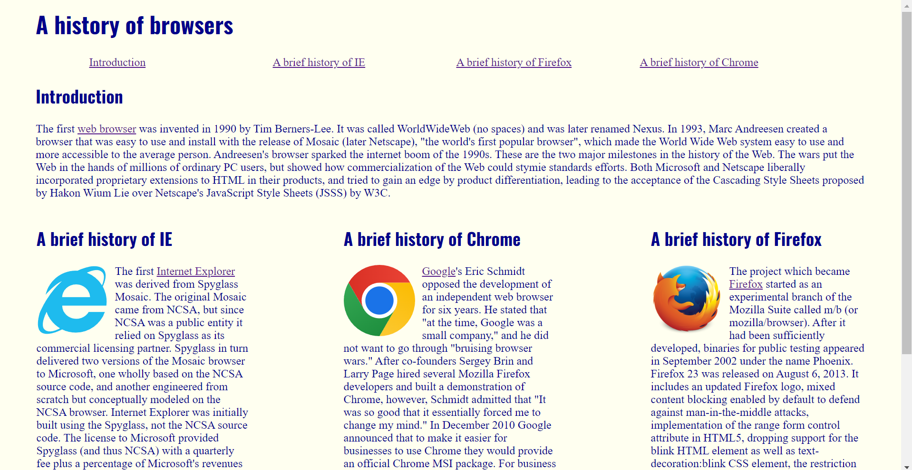
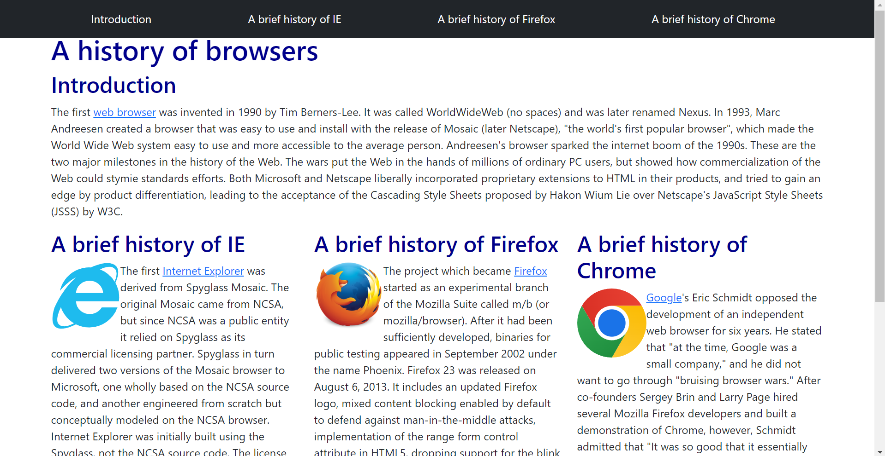

Bootstrap quickly went from being a huge pain to work with to something absolutely essential for creating a beautiful website. At first, I did not enjoy using it because of how strange it was to adjust from CSS styling to utilizing premade classes through Bootstrap. For example, instead of adding margins through CSS by using a stylesheet or a style declaration in your tag, you would have to declare a class with m-5, mx-5, or even my-5 in the tag to apply margins to your object. While this was not a huge adjustment, the plethora of classes at our disposal was a bit overwhelming, and trying to understand what each one did was a challenge in itself.
The biggest adjustment for me was getting used to the new classes, especially since, by default, VSCode does not provide IntelliSense for Bootstrap classes, which made it harder to know exactly what I had to type to achieve the desired styling. I ended up finding a Bootstrap IntelliSense extension on VSCode that has helped me become more confident in my Bootstrap coding and code faster. 

## Advantages of Using Bootstrap

Although there is a steep learning curve, Bootstrap makes website building ten times easier than it would be with traditional HTML and CSS. One of the things I love most about Bootstrap is the ability to easily create rows and columns. In HTML and CSS, there are many ways to do it, but none are very efficient, nor do they look very good. In Bootstrap, all you need is a row class followed by however many col classes you need. Below are some pictures of the same website made with HTML and CSS stylings compared to one made with just Bootstrap stylings.
 

  

    
  

  

    
  

 
Not only does the one on the right look better, but the code is also much cleaner and easier to read. As a beginner in HTML and CSS, I had trouble using 
 tags to separate my code since they aren’t necessarily required for most situations. However, with Bootstrap, they become far more useful. It almost feels like you’re encouraged to use 
 tags for almost everything due to all the possibilities they offer. The use of 
 tags also helps your code look cleaner and easier to understand since all your websites will be organized into their respective sections.

## Summing It Up

Overall, throughout the past week, I have fallen in love with using Bootstrap. HTML and CSS weren’t particularly hard to use before discovering Bootstrap, but with all the advantages it brings to the table, I can’t imagine making another website in the future without it. Not only does Bootstrap make styling a website easier, but it also helps make your code significantly more readable. Bootstrap encourages good coding practices by promoting the separation of website sections since just adding a simple 
 can significantly improve your website’s styling. From fluid images to navbars, Bootstrap really has it all. Despite the challenges of learning Bootstrap in a short amount of time, it truly is special, and I cannot wait to work with it more in the future.
