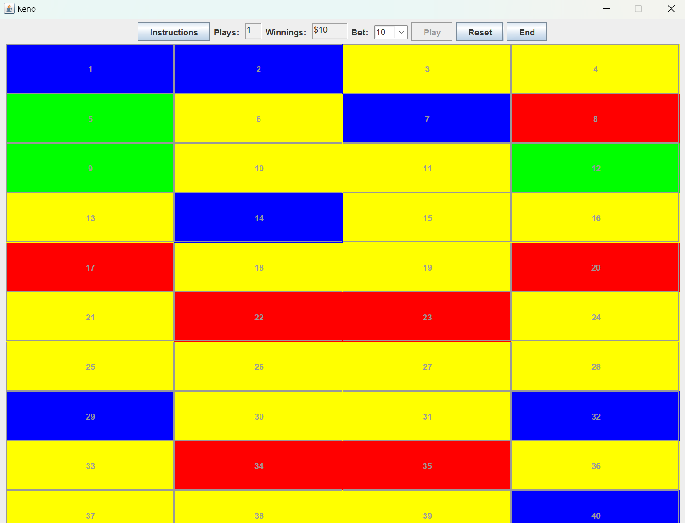

This is a project made with the IDE jGrasp for my ICS 211 course at Leeward Community College. This project was made to demonstrate proficiency in using Java's GUI elements and Java's File.io feature.

This project uses JButtons, TextFields, JLabels to create a user friendly, completely working and interactable game of Keno. The objective is to select 10 numbers of your choice and get money (or lose money) based on whether you guessed the same numbers as the computer or not. This project helped me understand how GUI works in Java and was my first real coding project that I could be proud of.

Source: <a href="https://github.com/jperry808/keno_game"><i class="large github icon "></i>jperry/ics-211-keno-game</a>

Video Demo: <a href="https://youtu.be/G32Hf0j7oVI"><i class="large github icon "></i>jperry/ics-211-keno-demo</a>

