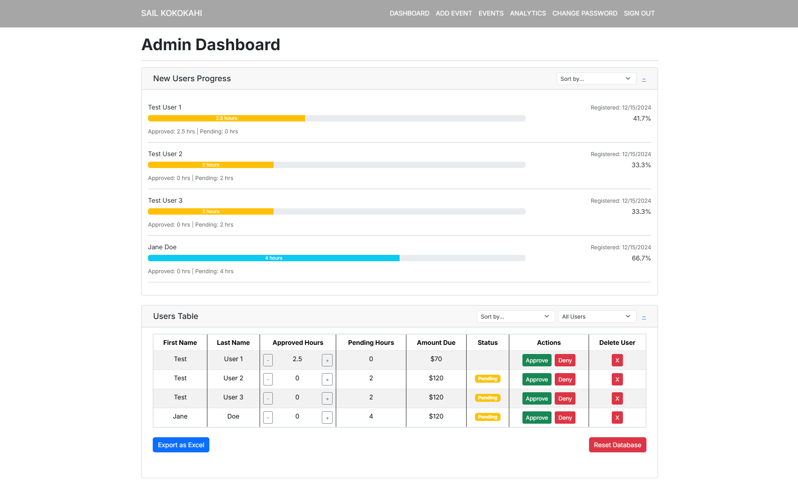

**Project Overview**
As part of my Software Engineering I class, I worked with two other team members to help create a system that tracks the sailing club, "Sail Kokokahi's" volunteer hours. This project used agile methodologies, specifically issue-driven management with Github, sepreate brances for features, and merges

**Team Collaboration and Roles**
Our team adopted a collaborative approach, with each member contributing to various aspects of the project. My part of the project was to manage and lead our team, along with developing the administrative features and member hour tracking features on the website. We as a team all supported eachother to maintain consistency across the site and to keep everyone aligned with the project goals.

**Technical Challenges and Learning**
Deploying a live website introduced us to the complexities of real-world software deployment. We implemented several features that required comprehensive backend and frontend coordination, including:
- User profiles where members can manage information and track their hours
- Scannable QR codes that allow members for easy check-in to events
- Charts and tables that contain member information for admins to track
- Volunteer events that members sign up for and admins monitor participation

**Outcome and Reflections**
The project was a success, resulting in a functional and aesthetically pleasing website that has been well received by the Sail Kokokahi community. It was a rewarding experience that enhanced our understanding of both the technical and managerial aspects of software development.

**Links and Resources**
- Explore our GitHub repository: [Sail Kokokahi GitHub](https://github.com/Sail-Kokokahi)
- Visit the live website: [Sail Kokokahi Live](https://sail-kokokahi-nine.vercel.app/)
- Check out our homepage: [Sail Kokokahi Homepage](https://sail-kokokahi.github.io/)
